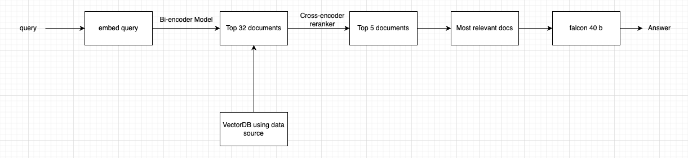

# AI Junior Developer (Intern) Test 
Welcome! and thank you for applying! 


## Architecture

1. Using Science-Wikipedia.pdf as data source
2. Dividing `pdf` into chunks.
3. Created `VectorDB`.
4. Embed `query`, on top of that apply `cosine similarity` followed by `cross encoder reranking`.
5. You will get `Most relevant documents`.
6. Apply `falcon-40b` model to create an `answer` to query. 
7. I am using `FASTAPI` here.




## Input Schema for `/chatbot` - POST request

```json
{
    "query" : "What is Science ?"
}
```

## Output Schema
```text
Science is ....
```

## Requirement
The current project has the blueprint structure of an AI App. 

Your mission is to implement an 💬NLP chatbot **answering questions about science**. 

You will add your logic to the `main.py` file inside the `execute` function. 
```python
def execute(request: SimpleText, ray: OpenfabricExecutionRay) -> SimpleText:
    output = []
    for text in request.text:        
        response = '' # <<< --Your magic goes here
        output.append(response)

    return SimpleText(dict(text=output))
```
## Constraints and restrictions
You are free to use any package or library you see feet as long as you follow these rules:
* 👎 You can't call any external service (e.g. chatGPT) 
* 👎 You can't copy and paste from other peoples work 

## Run
The application can be executed in two different ways:
* locally by running the `start.sh` 
* locally by running on FASTAPI `uvicorn app:app --proxy-headers --host 0.0.0.0 --port 80 --reload` 
* on in a docker container using `Dockerfile` 

## Docker commands
```bash
docker build -t open-fabric .
docker run --gpus all --publish 80:80 -it open-fabric
```

## Minimum requirements

1. Minimum GPU VRAM : 24 GB.

## Submission
Your solution must be uploaded on GitHub, and submit us the link in **max 1 week** after receiving the task.

## Note
Keep in mind that this is the project that will be used to evaluate your skills.
So we do expect you to make sure that the app is fully functional and doesn't have any obvious missing pieces.